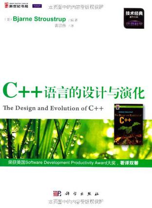
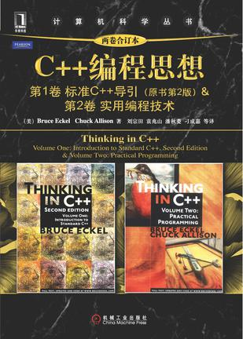
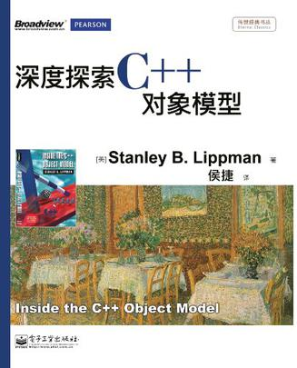
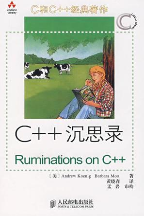
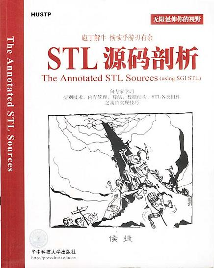
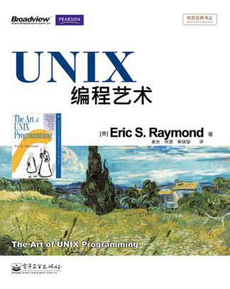
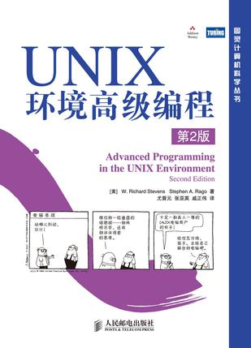
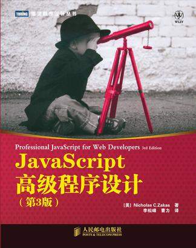

# 我的书单
## 目录
 * [前言](#前言)
 * [iOS](#ios)
 * [C/C++](#c/c++)
 * [Unix/Linux](#unix/linux)
 * [Java](#java)
 * [Web前端](#web前端)
 * [Android](#android)
 * [数据库](#数据库)
 * [Windows](#windows)
 * [算法研究](#算法研究)

## 前言
...

## iOS
--- | --- |
--- | --- |
[《Objective-C高级编程》][Objective-C高级编程]  作者：坂本一树 / 古本智彦  译者：黎华     | [《Effective Objective C 2.0》][Effective Objective C 2.0]  作者：Matt Galloway  译者：爱飞翔      |
[《iOS开发进阶》][iOS开发进阶]  作者：唐巧     | [《iOS测试指南》][iOS测试指南]  作者：芈峮     |

## C/C++
--- | --- |
--- | --- |
[《C++ Primer中文版》][C++ Primer中文版]   作者：Stanley B.Lippman / Josée LaJoie / Barbara E.Moo  译者：李师贤 / 蒋爱军 / 梅晓勇 / 林瑛     | [《C++语言的设计与演化》][C++语言的设计与演化]  作者：Bjarne Stroustrup  译者：裘宗燕     |
[《Effective C++》][Effective C++]  作者：Scott Meyers   译者：侯捷     | [《More Effective C++》][More Effective C++]  作者：Scott Meyers   译者：侯捷     |
[《C++编程思想》][C++编程思想]  作者：Bruce Eckel / Chuck Allison    译者：刘宗田 / 袁兆山 / 潘秋菱 / 刁成嘉      | [《深度探索C++对象模型》][深度探索C++对象模型]  作者：Stanley B.Lippman  译者：侯捷     |
[《C++沉思录》][C++沉思录]  作者：Andrew Koenig / Barbara Moo  译者： 黄晓春 / 孟岩（审校）     | [《STL源码剖析》][STL源码剖析]  作者：侯捷        |

## Unix/Linux
--- | --- |
--- | --- |
[《UNIX网络编程 卷1：套接字联网API》][UNIX网络编程 卷1：套接字联网API]  作者：W.Richard Stevens / Bill Fenner / Andrew M. Rudoff  译者：杨继张      | [《UNIX网络编程 卷2：进程间通信》][UNIX网络编程 卷2：进程间通信]  作者：W.Richard Stevens       |
[《UNIX编程艺术》][UNIX编程艺术]  作者：Eric S. Raymond   译者：姜宏 / 何源 / 蔡晓俊       | [《UNIX环境高级编程》][UNIX环境高级编程]  作者：W.Richard Stevens / Stephen A.Rago  译者：尤晋元 / 张亚英 / 戚正伟     |

## Java
--- | --- |
--- | --- |

## Web前端
--- | --- |
--- | --- |
[《JavaScript高级程序设计》][JavaScript高级程序设计]   作者：Nicholas C. Zakas  译者：李松峰 / 曹力     | [《锋利的jQuery》][锋利的jQuery]   作者：单东林 / 张晓菲 / 魏然       |

## Android
--- | --- |
--- | --- |

## 数据库
--- | --- |
--- | --- |

## Windows
--- | --- |
--- | --- |

## 算法研究
--- | --- |
--- | --- |

[----]: "------------------------------------------------------------------------------------------------------------------------------------------------------------------------------------------------------------------------------------------------------------"

[iOS开发]: ""
[iOS测试指南]:http://book.douban.com/subject/25861674/
[Effective Objective C 2.0]:http://book.douban.com/subject/25829244/
[iOS开发进阶]:http://book.douban.com/subject/26287173/
[Objective-C高级编程]:http://book.douban.com/subject/24720270/

[C/C++开发]: ""
[C++ Primer中文版]:http://book.douban.com/subject/1767741/ "C++ Primer中文版"
[C++语言的设计与演化]:http://book.douban.com/subject/10536031/ "C++语言的设计与演化"
[Effective C++]:http://book.douban.com/subject/5387403/ "Effective C++"
[More Effective C++]:http://book.douban.com/subject/5908727/ "More Effective C++"
[C++编程思想]:http://book.douban.com/subject/6558198/ "C++编程思想"
[深度探索C++对象模型]:http://book.douban.com/subject/10427315/ "深度探索C++对象模型"
[C++沉思录]:http://book.douban.com/subject/2970056/ "C++沉思录"
[STL源码剖析]:http://book.douban.com/subject/1110934/ "STL源码剖析"

[Unix/Linux开发]: ""
[UNIX网络编程 卷1：套接字联网API]:http://book.douban.com/subject/4859464/ "UNIX网络编程 卷1：套接字联网API"
[UNIX网络编程 卷2：进程间通信]:http://book.douban.com/subject/4886882/ "UNIX网络编程 卷2：进程间通信"
[UNIX环境高级编程]:http://book.douban.com/subject/1788421/ "UNIX环境高级编程"
[UNIX编程艺术]:http://book.douban.com/subject/5387401/ "UNIX编程艺术"

[Java开发]: ""

[Web前端开发]: ""
[JavaScript高级程序设计]:http://book.douban.com/subject/10546125/ "JavaScript高级程序设计"
[锋利的jQuery]:http://book.douban.com/subject/10792216/ "锋利的jQuery"

[Android开发]: ""

[数据库开发]: ""

[Windows开发]: ""

[算法研究]: ""