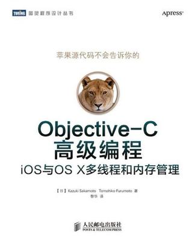
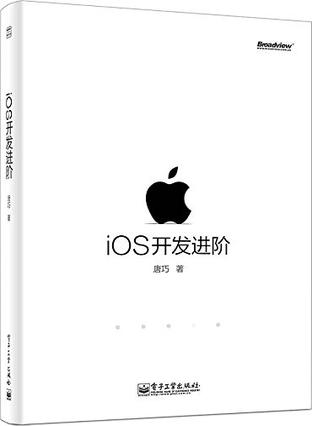
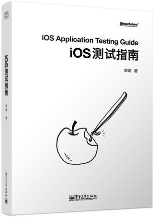

# 我的书单

## iOS开发书单
--- | --- |
--- | --- |
[《Objective-C高级编程》][Objective-C高级编程] by 坂本一树 / 古本智彦     | [《Effective Objective C 2.0》][Effective Objective C 2.0] by Matt Galloway      |
[《iOS开发进阶》][iOS开发进阶] by 唐巧     | [《iOS测试指南》][iOS测试指南] by 芈峮     |

## C/C++开发书单
--- | --- |
--- | --- |

## Java开发书单
--- | --- |
--- | --- |

## Web前段开发书单
--- | --- |
--- | --- |

[----]: "------------------------------------------------------------------------------------------------------------------------------------------------------------------------------------------------------------------------------------------------------------"

[iOS开发书单]:
[iOS测试指南]:http://book.douban.com/subject/25861674/
[Effective Objective C 2.0]:http://book.douban.com/subject/25829244/
[iOS开发进阶]:http://book.douban.com/subject/26287173/
[Objective-C高级编程]:http://book.douban.com/subject/24720270/

[C/C++开发书单]:

[Java开发书单]:

[Web前段开发书单]: